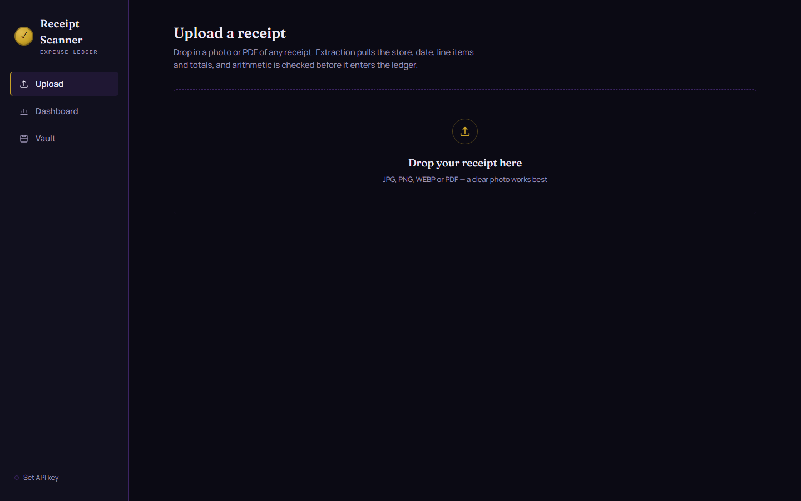
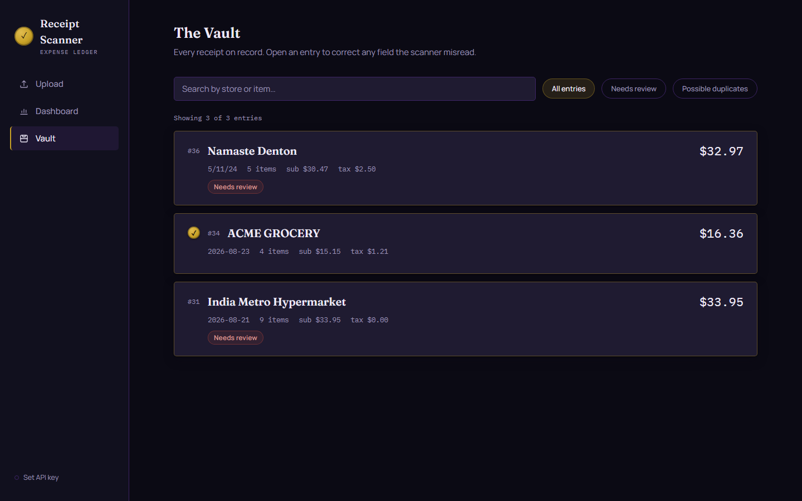
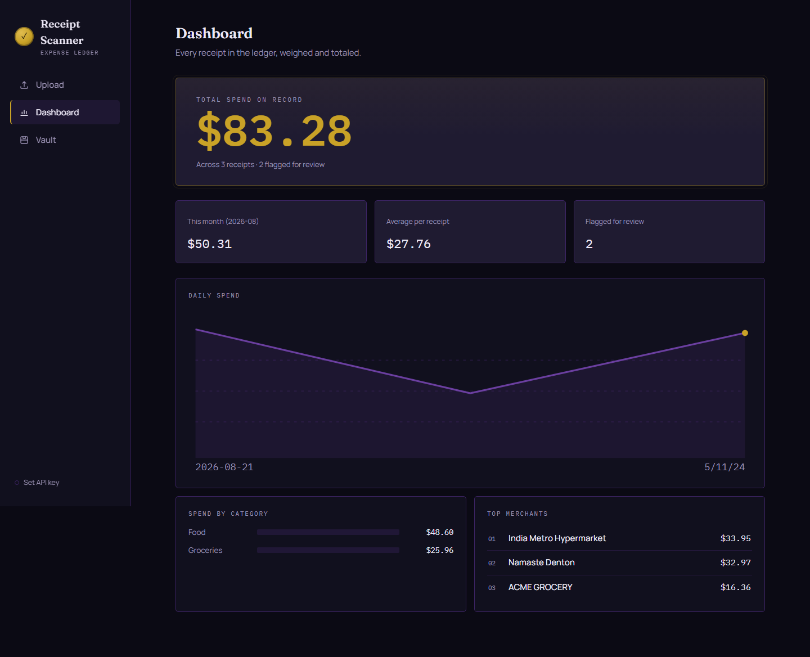
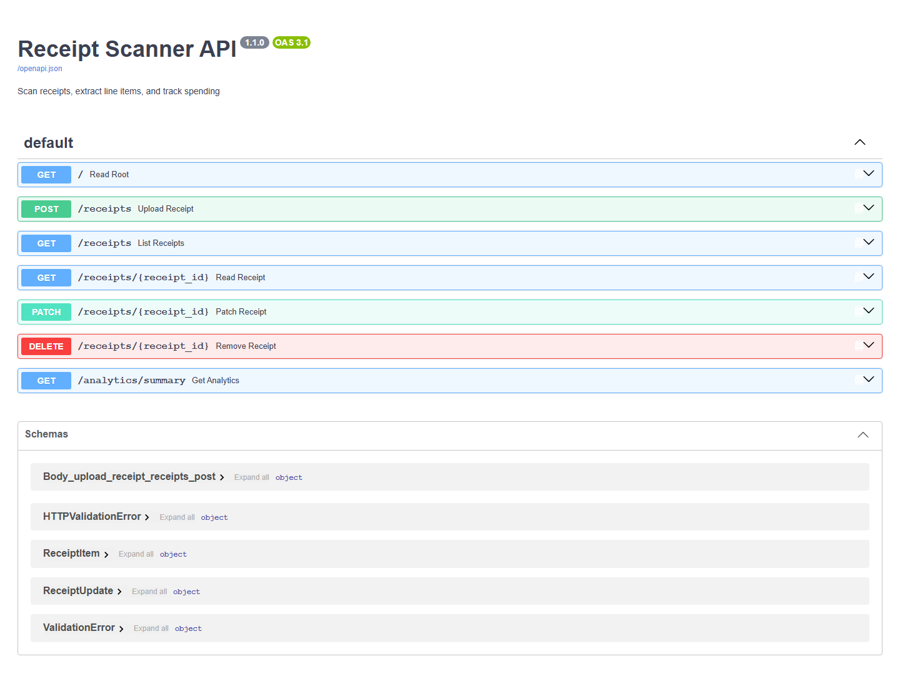

# 🧾 Receipt Scanner

A local-first receipt scanner and expense tracker. Upload a photo or PDF of any receipt — the vision LLM extracts merchant, date, line items, prices, and categories in a single call. Arithmetic is validated, duplicates are detected, and everything lands in SQLite. A dashboard (Streamlit or React + Vite) shows spending by category, merchant, and date range.

---

## Screenshots

### React + Vite Frontend (Dark Royal Theme)

| Upload | Vault | Dashboard |
|--------|-------|-----------|
|  |  |  |

### FastAPI Interactive Docs



---

## Architecture

```
Receipt Image / PDF
        ↓
Vision LLM API  (single call, structured JSON output)
        ↓
clean_json_response()   (strips markdown fences, reasoning tags, isolates JSON)
        ↓
Pydantic validation     (strict Receipt schema)
        ↓
normalize_merchant()    (dict-based canonicalization)
        ↓
validate_totals()       (subtotal + tax ≈ total ±$0.02; sum(items) ≈ subtotal ±$0.05)
        ↓
Duplicate detection     (SHA-256 exact match → hard reject; merchant+date+total fingerprint → soft flag)
        ↓
SQLite                  (single file, items stored as JSON column)
        ↓
FastAPI REST API + Streamlit Dashboard + React Frontend
```

**Why each step matters:**

- **Single-call extraction** — No OCR pipeline, no multi-agent orchestration. The vision model returns structured JSON directly.
- **JSON cleaning** — Handles markdown fences, reasoning model `think` tags, and conversational wrapping automatically.
- **Pydantic validation** — Rejects malformed responses at the schema level before any business logic runs.
- **Arithmetic validation** — Catches model hallucinations on totals. A receipt where numbers don't add up is flagged `needs_review` rather than silently accepted.
- **Merchant normalization** — Maps variants (`wal-mart`, `amzn mktp us`, `costco wholesale corp`) to canonical names for clean analytics.
- **Two-tier duplicate detection** — SHA-256 catches exact re-uploads (HTTP 409). Fingerprint matching (merchant + date + total within $0.02) flags probable duplicates from different photos of the same receipt.
- **Model fallback** — Configurable primary/fallback models per provider; automatic retry on failure.

---

## Features

- **One-call extraction** — Each receipt processed by a single vision LLM call, no OCR, no multi-agent pipeline
- **Structured output** — LLM returns JSON; Pydantic validates against a strict schema
- **Arithmetic validation** — Checks `subtotal + tax ≈ total` (±$0.02) and `sum(items) ≈ subtotal` (±$0.05); flags mismatches as `needs_review`
- **Merchant normalization** — Maps receipt variants (`wal-mart`, `amzn mktp us`, `costco wholesale corp`) to clean names via a simple dict
- **Duplicate detection** — Exact image SHA-256 hash rejects re-uploads (HTTP 409); fingerprint match (same merchant + date + total) flags probable duplicates
- **PDF support** — PDF receipts rendered to PNG (first page) via PyMuPDF before extraction
- **Multi-provider support** — Switch between NVIDIA NIM, OpenAI, and Anthropic via `VISION_PROVIDER` env var
- **Model fallback** — Configurable primary/fallback models per provider; automatic retry on failure
- **Manual correction** — Edit any field (merchant, date, totals, item names/prices/categories) from the dashboard or API
- **Analytics** — Spend by category, merchant, and day; filterable by custom date range
- **Streamlit dashboard** — Upload, analytics charts, and receipt vault/editor in a single app
- **React + Vite frontend** — Modern dark-themed UI with upload, vault, analytics, and manual editing
- **16 automated tests** — Schema validation, normalization, arithmetic tolerances, JSON parsing resilience, SQLite CRUD, API integration, duplicate detection, PDF rendering

---

## Tech Stack

| Layer      | Technology                                             |
| :--------- | :----------------------------------------------------- |
| AI         | Vision LLM API (NVIDIA NIM, OpenAI, Anthropic)         |
| Validation | Pydantic v2                                            |
| Backend    | FastAPI                                                |
| Database   | SQLite (single file)                                   |
| Dashboard  | Streamlit                                              |
| Frontend   | React 18 + Vite + CSS Modules (dark royal theme)       |
| PDF        | PyMuPDF                                                |
| Testing    | pytest + FastAPI TestClient                            |

The provider/model is configurable via `.env` — swap between NVIDIA NIM, OpenAI, and Anthropic without code changes.

---

## Quickstart

### 1. Clone & install

```bash
git clone https://github.com/akhil27/receipt-scanner.git
cd receipt-scanner
pip install -r requirements.txt
```

### 2. Configure

Copy `.env.example` to `.env` and add your API key:

```bash
cp .env.example .env
```

Choose your provider and configure:

```env
# Vision Provider: nvidia | openai | anthropic
VISION_PROVIDER=nvidia

# NVIDIA NIM (default)
NVIDIA_API_KEY=nvapi-your-key-here
NVIDIA_MODEL=meta/llama-3.2-11b-vision-instruct
NVIDIA_MODEL_FALLBACK=meta/llama-3.2-90b-vision-instruct

# OpenAI
OPENAI_API_KEY=your-openai-api-key-here
OPENAI_MODEL=gpt-4o-mini
OPENAI_BASE_URL=https://api.openai.com/v1

# Anthropic
ANTHROPIC_API_KEY=your-anthropic-api-key-here
ANTHROPIC_MODEL=claude-3-5-sonnet-20241022
```

- **NVIDIA NIM**: Get a free key at [build.nvidia.com](https://build.nvidia.com)
- **OpenAI**: Get a key at [platform.openai.com](https://platform.openai.com)
- **Anthropic**: Get a key at [console.anthropic.com](https://console.anthropic.com)

### 3. Run

**Option A: Streamlit Dashboard**

```bash
streamlit run dashboard.py
```

**Option B: React + Vite Frontend**

```bash
cd frontend
npm install
npm run dev
```

**FastAPI server** (REST API for both frontends or direct use):

```bash
uvicorn main:app --reload --port 8000
```

Interactive API docs at `http://localhost:8000/docs`.

---

## API Reference

| Method   | Endpoint                | Description                                                       |
| :------- | :---------------------- | :---------------------------------------------------------------- |
| `POST`   | `/receipts`             | Upload image/PDF → extract → validate → save                     |
| `GET`    | `/receipts`             | List receipts (filter: `?needs_review=true`, `?merchant=walmart`) |
| `GET`    | `/receipts/{id}`        | Single receipt with line items                                    |
| `PATCH`  | `/receipts/{id}`        | Update any field (merchant, date, total, items, needs_review)     |
| `DELETE` | `/receipts/{id}`        | Delete a receipt                                                  |
| `GET`    | `/analytics/summary`   | Aggregated spend by category, merchant, day (`?start=&end=`)      |
| `GET`    | `/images/{filename}`    | Serve uploaded receipt images                                     |

### Upload example

```bash
curl -X POST http://localhost:8000/receipts \
  -F "file=@receipt.jpg"
```

---

## Categories

The vision model assigns each item to one of these categories:

`Food` · `Groceries` · `Restaurant` · `Alcohol` · `Household` · `Electronics` · `Health` · `Transportation` · `Entertainment` · `Other`

---

## Duplicate Detection

1. **Exact duplicate** (same image bytes) — SHA-256 hash match → upload rejected with HTTP 409
2. **Probable duplicate** (different image, same merchant + date + total ±$0.02) — receipt is saved but flagged `possible_duplicate: true`

---

## Tests

```bash
pytest -v
```

Test coverage:

| Area                     | What's tested                                                        |
| :----------------------- | :------------------------------------------------------------------- |
| Schema validation        | Required fields, invalid types, defaults, partial updates            |
| Merchant normalization   | Case, whitespace, known variants, unknown/accented names             |
| Arithmetic validation    | Exact match, ±$0.02 boundary, ±$0.05 item sum, zero, negatives      |
| JSON parsing             | Markdown fences, `think` tags, conversational wrapping              |
| SQLite CRUD              | Empty DB, 100-item receipts, partial updates, SQL injection safety   |
| FastAPI endpoints        | CORS, file type validation, CRUD lifecycle, filters, 404/409/422     |
| Duplicate detection      | Hash lookup, fingerprint tolerance, API reject/flag behavior         |
| PDF support              | First-page rendering, mime type detection                            |

---

## Project Structure

```
receipt-scanner/
├── .env                  # API keys (gitignored)
├── .env.example          # Template
├── .gitignore
├── requirements.txt
├── models.py             # Pydantic schemas
├── nim_client.py         # Vision LLM API client, validation, normalization
├── db.py                 # SQLite setup, CRUD, analytics, duplicate detection
├── main.py               # FastAPI endpoints
├── dashboard.py          # Streamlit dashboard
├── receipts/             # Uploaded images (gitignored)
├── receipts.db           # SQLite database (gitignored)
├── frontend/             # React + Vite frontend (gitignored node_modules/, dist/)
├── screenshots/          # UI screenshots
└── tests/
    └── test_receipt_scanner.py
```